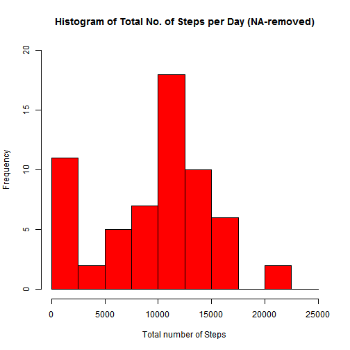
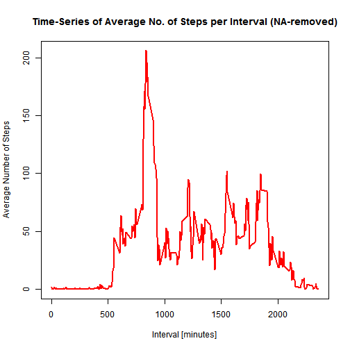
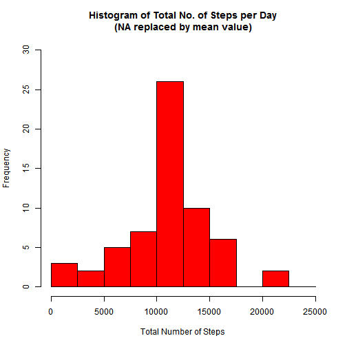
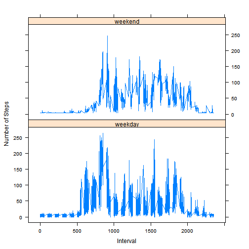

## Introduction

This assignment makes use of data from a personal activity monitoring device. This device collects data at 5 minute intervals throughout the day. The data consists of two months of data from an anonymous individual collected during the months of October and November, 2012 and include the number of steps taken in 5 minute intervals each day.

This document presents the results from Project Assignment 1 in the Coursera course Reproducible Research, written in a single R markdown document that can be processed by knitr and transformed into an HTML file.

## R Preparation

In this document code will be represented to show how the results have been achieved. Set the default of echo to be true throughout the document:


```r
library(knitr)
opts_chunk$set(echo = TRUE)
```

## Load and preprocess the data

Ensure that the 'activity' data file is in your R working directory.


```r
# Load the raw data into R
activity_rawdata <- read.csv("activity.csv", stringsAsFactors=FALSE)
```


```r
# Transform the date variable to an actual date format
activity_rawdata$date <- as.POSIXct(activity_rawdata$date, format="%Y-%m-%d")

# Compute the weekdays from the date variable
activity_rawdata <- data.frame(date=activity_rawdata$date,
                               weekday=tolower(weekdays(activity_rawdata$date)),
                               steps=activity_rawdata$steps,
                               interval=activity_rawdata$interval)

# Compute the day type (weekend or weekday) and add it to data frame
activity_rawdata <- cbind(activity_rawdata,
                          daytype=ifelse(activity_rawdata$weekday=="saturday"|
                                         activity_rawdata$weekday=="sunday", "weekend", 
                                         "weekday"))

# Create the activity final data frame
activity_finaldata <- data.frame(date=activity_rawdata$date,
                                 weekday=activity_rawdata$weekday,
                                 daytype=activity_rawdata$daytype,
                                 interval=activity_rawdata$interval,
                                 steps=activity_rawdata$steps)
```

Display the first few rows of the processed and final activity data frame:


```r
head(activity_finaldata)
```

```
##         date weekday daytype interval steps
## 1 2012-10-01  monday weekday        0    NA
## 2 2012-10-01  monday weekday        5    NA
## 3 2012-10-01  monday weekday       10    NA
## 4 2012-10-01  monday weekday       15    NA
## 5 2012-10-01  monday weekday       20    NA
## 6 2012-10-01  monday weekday       25    NA
```

## What is the mean total number of steps taken per day?

For this part of the assignment, you can ignore the missing values in the dataset.

1. Calculate the total number of steps taken per day


```r
# Compute the total number of steps each day (NA values removed)
steps_perDay <- aggregate(activity_finaldata$steps, 
                          by=list(activity_finaldata$date), FUN=sum, na.rm=TRUE)

# Name the variables for the steps_perDay data frame
names(steps_perDay) <- c("date", "total")
```

Display the first few rows of the steps_perDay data frame:


```r
head(steps_perDay)
```

```
##         date total
## 1 2012-10-01     0
## 2 2012-10-02   126
## 3 2012-10-03 11352
## 4 2012-10-04 12116
## 5 2012-10-05 13294
## 6 2012-10-06 15420
```

2. Generate a histogram for the total number of steps per day


```r
hist(steps_perDay$total, 
     breaks=seq(from=0, to=25000, by=2500),
     col="red", 
     xlab="Total number of Steps", 
     ylim=c(0, 20), 
     main="Histogram of Total No. of Steps per Day (NA-removed)")
```



3. Calculate and report the mean and median total number of steps per day


```r
mean(steps_perDay$total)
```

```
## [1] 9354.23
```

```r
median(steps_perDay$total)
```

```
## [1] 10395
```

The mean and median are 9354 and 10395 respectively.

## What is the average daily activity pattern?

1. Make a time series plot (i.e. type = "l") of the 5-minute interval (x-axis) and the average number of steps taken, averaged across all days (y-axis)


```r
# Compute the mean of steps accross all days for each interval
steps_means <- aggregate(activity_finaldata$steps, 
                         by=list(activity_finaldata$interval), 
                         FUN=mean, na.rm=TRUE)

# Name the variables for the steps_means data frame
names(steps_means) <- c("interval", "mean")
```

Display the first few rows of the steps_means data frame:


```r
head(steps_means)
```

```
##   interval      mean
## 1        0 1.7169811
## 2        5 0.3396226
## 3       10 0.1320755
## 4       15 0.1509434
## 5       20 0.0754717
## 6       25 2.0943396
```


```r
# Compute the time series plot
plot(steps_means$interval, 
     steps_means$mean, 
     type="l", 
     col="red", 
     lwd=2, 
     xlab="Interval [minutes]", 
     ylab="Average Number of Steps", 
     main="Time-Series of Average No. of Steps per Interval (NA-removed)")
```



2. Which 5-minute interval, on average across all the days in the dataset, contains the maximum number of steps?


```r
# Find the position of the maximum mean
max_position <- which(steps_means$mean==max(steps_means$mean))

# Lookup the value of interval at this position
max_interval <- steps_means[max_position, 1]
```

The 5-minute interval that contains the maximum number of steps, on average across all days, is 835.

## Inputing the missing values

Note that there are a number of days/intervals where there are missing values (coded as NA). The presence of missing days may introduce bias into some calculations or summaries of the data.

1. Calculate and report the total number of missing values in the dataset (i.e. the total number of rows with NA's)


```r
# Use the fact that a TRUE boolean value is equivalent to 1 and a FALSE to 0.
NA_count <- sum(is.na(activity_finaldata$steps))
```

The number of NA's is 2304.

2. Devise a strategy for filling in all of the missing values in the dataset. The strategy does not need to be sophisticated. For example, you could use the mean/median for that day, or the mean for that 5-minute interval, etc.


```r
# Find the NA positions
na_position <- which(is.na(activity_finaldata$steps))

# Create a vector of means
means_vector <- rep(mean(activity_finaldata$steps, na.rm=TRUE),
                    times=length(na_position))
```

Use this strategy to replace each NA value by the mean of the steps variable.

3. Create a new dataset that is equal to the original dataset but with the missing data filled in.


```r
# Replace the NAs by the means
activity_finaldata[na_position, "steps"] <- means_vector
```

Display the first few rows of the new activity_finaldata data frame:


```r
head(activity_finaldata)
```

```
##         date weekday daytype interval   steps
## 1 2012-10-01  monday weekday        0 37.3826
## 2 2012-10-01  monday weekday        5 37.3826
## 3 2012-10-01  monday weekday       10 37.3826
## 4 2012-10-01  monday weekday       15 37.3826
## 5 2012-10-01  monday weekday       20 37.3826
## 6 2012-10-01  monday weekday       25 37.3826
```

4. Make a histogram of the total number of steps taken each day and calculate and report the mean and median total number of steps taken per day. Do these values differ from the estimates from the first part of the assignment? What is the impact of imputing missing data on the estimates of the total daily number of steps?


```r
# Compute the total number of steps each day (NA values removed)
steps_perDay <- aggregate(activity_finaldata$steps,
                          by=list(activity_finaldata$date), FUN=sum)

# Rename the variables
names(steps_perDay) <- c("date", "total")

# Compute the histogram of the total number of steps each day
hist(steps_perDay$total, 
     breaks=seq(from=0, to=25000, by=2500),
     col="red", 
     xlab="Total Number of Steps", 
     ylim=c(0, 30), 
     main="Histogram of Total No. of Steps per Day\n(NA replaced by mean value)")
```




```r
# Compute the mean and median
mean(steps_perDay$total)
```

```
## [1] 10766.19
```

```r
median(steps_perDay$total)
```

```
## [1] 10766.19
```

The mean and median are 10766 and 10766 respectively.

These values differ significantly from the estimates from the first part of the assignment. The impact of imputing the missing values is having more data in the data set, therefore leading to a larger computed mean and median value.

## Are there differences in activity patterns between weekdays and weekends?

Use the dataset with the filled-in missing values for this part.

1. Create a new factor variable in the dataset with two levels: "weekdays" and "weekend", indicating whether a given date is a weekday or weekend day.


```r
# The new factor variable "daytype" was already in the activity data frame
head(activity_finaldata)
```

```
##         date weekday daytype interval   steps
## 1 2012-10-01  monday weekday        0 37.3826
## 2 2012-10-01  monday weekday        5 37.3826
## 3 2012-10-01  monday weekday       10 37.3826
## 4 2012-10-01  monday weekday       15 37.3826
## 5 2012-10-01  monday weekday       20 37.3826
## 6 2012-10-01  monday weekday       25 37.3826
```

2. Make a panel plot containing a time series plot (i.e. type = "l") of the 5- minute interval (x-axis) and the average number of steps taken, averaged across all weekday days or weekend days (y-axis).


```r
# Load the lattice graphical library
library(lattice)

# Compute the average number of steps taken, averaged across all daytype variable
steps_means <- aggregate(activity_finaldata$steps, 
                         by=list(activity_finaldata$daytype, 
                                 activity_finaldata$weekday,
                                 activity_finaldata$interval), mean)

# Name the variables for the steps_means data frame 
names(steps_means) <- c("daytype", "weekday", "interval", "mean")
```

Display the first few rows of the steps_means data frame:


```r
head(steps_means)
```

```
##   daytype  weekday interval     mean
## 1 weekday   friday        0 8.307244
## 2 weekday   monday        0 9.418355
## 3 weekend saturday        0 4.672825
## 4 weekend   sunday        0 4.672825
## 5 weekday thursday        0 9.375844
## 6 weekday  tuesday        0 0.000000
```


```r
# Compute the time series plot
xyplot(mean ~ interval | daytype, steps_means, 
       type="l", 
       lwd=1, 
       xlab="Interval", 
       ylab="Number of Steps", 
       layout=c(1,2))
```



From the two plots it seems that the test person is more active earlier in the day during weekdays compared to weekends, but more active throughout the weekends compared with weekdays (probably because the person is working during the weekdays, therefore moving less during the day).


